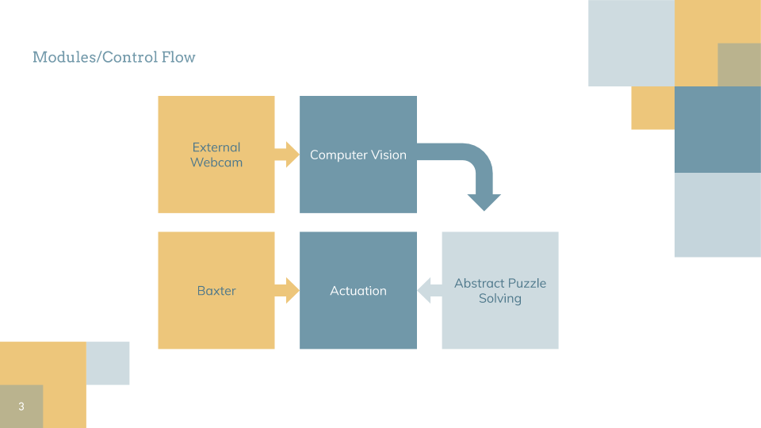
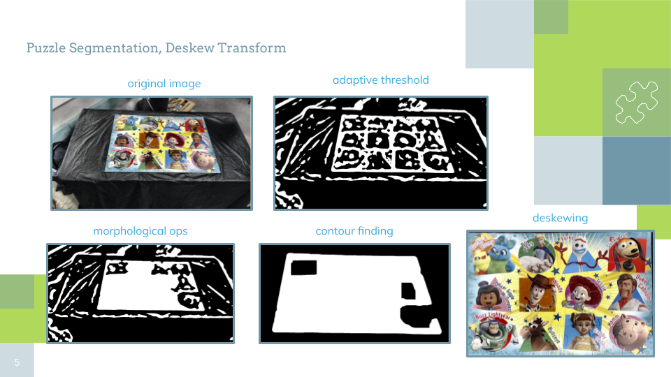
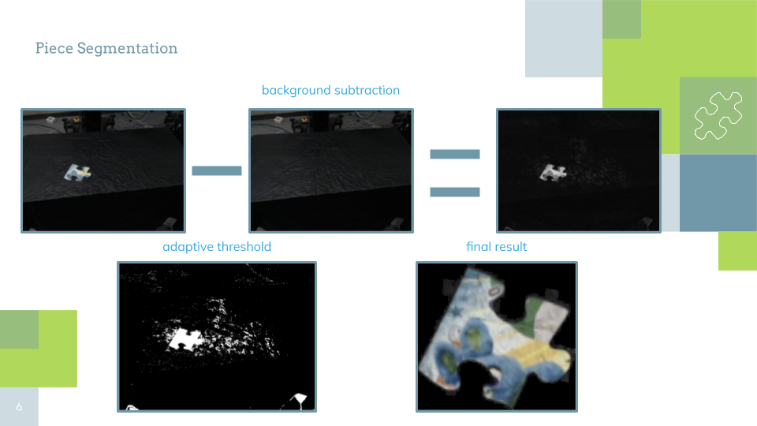
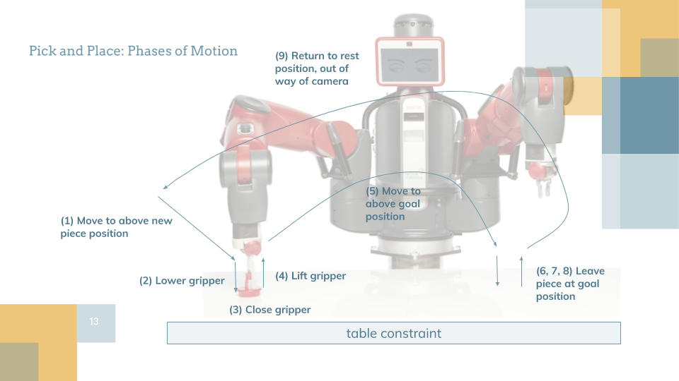
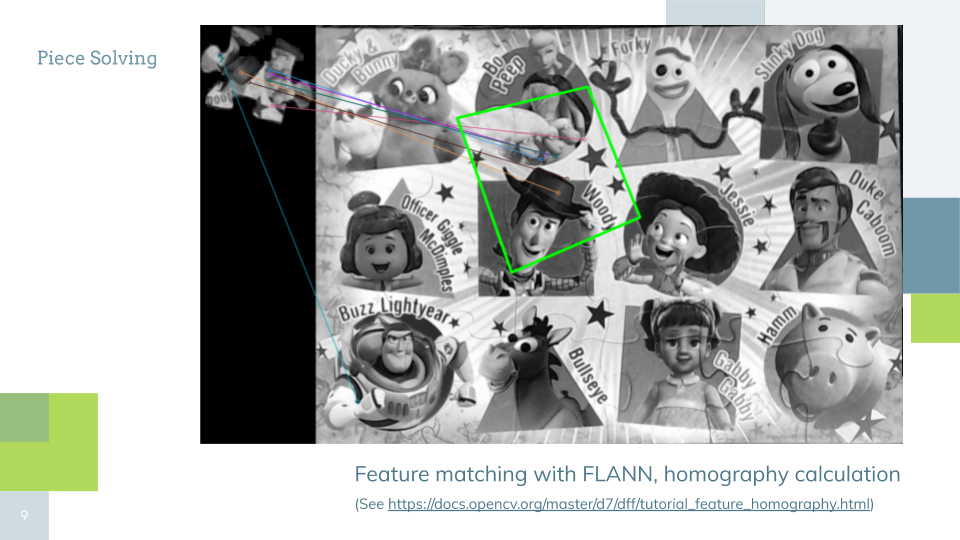

## Introduction
Have you ever wanted your resident large, expensive humanoid robot to help you solve a children's puzzle? We aim to show how a Baxter robot can be programmed to solve a jigsaw puzzle with computer vision techniques and minimal human interaction. More concretely, we give the robot an image of the completed puzzle, along with the puzzle's dimensions and number of pieces, then place pieces on the table one by one and have Baxter place them with correct position and orientation.

## Design + Implementation

### Hardware
We worked with:
- 1 arm of the [Baxter robot](https://en.wikipedia.org/wiki/Baxter_(robot)) with [suction gripper kit](https://www.generationrobots.com/en/401622-vacuum-gripper-starter-kit-for-baxter.html)
- large floor puzzle: 24 pieces
- Logitech C920 webcam + tripod
- [AR tag](https://en.wikipedia.org/wiki/ARTag)

 

### Calibration

We break up our approach to puzzle solving into two main stages: calibration and a piece solver loop. 

The purpose of the calibration stage is to connect the pixel coordinates of images from the camera with physical coordinates usable by baxter. To do this, we:

1. Place a square AR tag at the upper left corner of the area in which Baxter will solve the puzzle
2. Capture an image from the webcam, segment the AR tag, and calculate a deskewing transformation using the expected orientation and aspect ratio (1:1 for a square) of the AR tag when viewed top-down. This deskewing transformation allows us to transform raw images from the camera into a "deskewed pixel space" that simulates what the image would like like if the camera were directly above the table, pointing downwards. By calculating the center of the segmented AR tag in deskewed pixel space, we get the origin of our puzzle-solving coordinate frame in deskewed pixel space.
 
3. Place baxter's camera directly above the AR tag pointing down. We then process the images from Baxter's hand camera with AR tag recognition software  to find the coordinate transformation between Baxter's hand and the AR tag. This allows us to calculate the coordinate transformation between Baxter and the middle of the AR tag. We store this transformation, allowing Baxter to know where the origin of the puzzle-solving coordinate frame is even after the AR tag is removed.
4. Remove the AR tag. Baxter is now ready to solve the puzzle!

### Physical Piece Solving

Physical Piece solving (picking up and placing a new piece with roughly correct position and orientation) uses the following loop:
1. **Capture an image** of the table before the new piece is placed
2. Put the new piece on the table roughly at the origin, and capture another image. Using pixel-wise absolute difference between this image and the one from the previous step (and some additional processing), we **segment the new puzzle piece**.
 
3. Using the deskewed pixel position and rotation of the piece from Abstract Piece Solving _(see next section)_, **compute the physical coordinates where the piece should be placed**. This step also requires pixels-per-meter (ppm) in the deskewed image space, which is calculated with knowledge of the dimensions of the AR tag from the original calibration image. 
4. Using the moveit motion planning library, have Baxter pick up the piece from the origin and place it at the desired location with the desired orientation.

### Abstract Piece Solving

Abstract Piece Solving refers to the problem of: given a (mostly) segmented image of a puzzle piece as well as a reference image of the completed puzzle, determine the location (in pixel coordinates) and rotation of the piece within the reference image. The steps were as follows:

1. Use SURF keypoint matching to calculate the transformation (known as a homography) that maps from pixels in the piece image to pixels in the reference image. [see this](https://docs.opencv.org/master/d7/dff/tutorial_feature_homography.html) for reference. If SURF fails, try [SIFT](https://docs.opencv.org/3.4/da/df5/tutorial_py_sift_intro.html) instead.

2. Calculate the angle between the top edge of the original piece image and that edge after being transformed by the found homography.

3. Calculate the centroid of the image of the homography. We assume the puzzle is grid-like in that each piece in the solved puzzle has a clear row and column index. Therefore, we use the closest location on that implicit grid as the outputted piece location.

## Challenges

As can be seen from our videos, one of the main challenges we faced was the losses of precision incurred in the conversion from pixel position to physical position. The main causes of these losses were:
- problems with the baxter hand camera image quality made AR tag recognition somewhat suspect in the calibration phase
- not placing pieces directly on the origin, causing pickup to fail
- the suction gripper would sometime latch on to a piece at a non-center point of the piece; this caused problems because our algorithm attempts to have Baxter release the piece directly above the location determined to be that piece's correct center in physical coordinates.
- The simplification we made by assuming the puzzle is roughly gridlike is not perfect (i.e. piece centers don't fall exactly on the intersection points of the grid), so even if all else goes right the piece may be place slightly off center from its correct final position.
- For the particular Baxter we were using, the camera feed from the right hand was interpreted as coming from the left hand's camera, and vice versa. This meant that instead of just using built in transform calculation packages that worked with the AR tag package, we had to manually compose transforms to determine the transform between the base of the Baxter robot and the origin of the puzzle-solving frame.

### Results

We were able to largely accomplish our goal of having Baxter be able to assist in solving a large jigsaw puzzle! Our short video shows Baxter placing 5 different puzzle pieces in roughly the correct positions and almost perfect orientations. Besides minor hiccups in piece pickup, the video shows how Baxter could theoretically assist with solving an entire puzzle.

Using the puzzle assistant in practice is not the most user-friendly, but it also performs a nontrivial task. After taking any large jigsaw puzzle and inputting a reference image for it (taken from a picture of the box, for example) and the puzzle dimensions, you can have Baxter do all the "heavy lifting" of solving the puzzle for you!



This website showcases the work of Rebecca Abraham, Jason Huynh, and Evan Lohn on a primarily self-directed EECS C106A class project.
